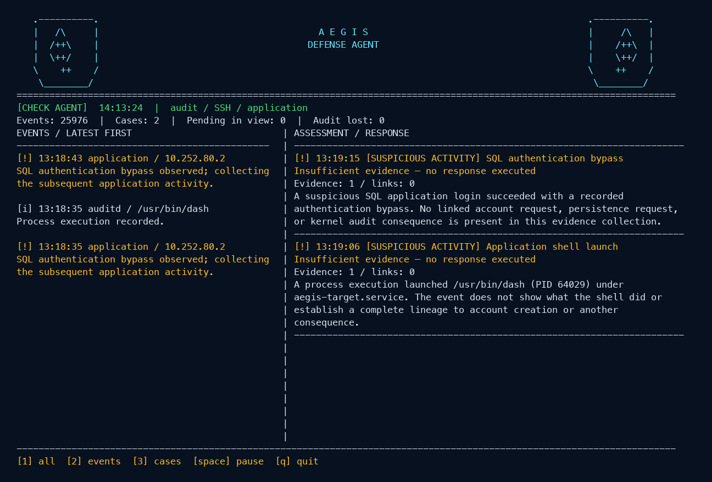
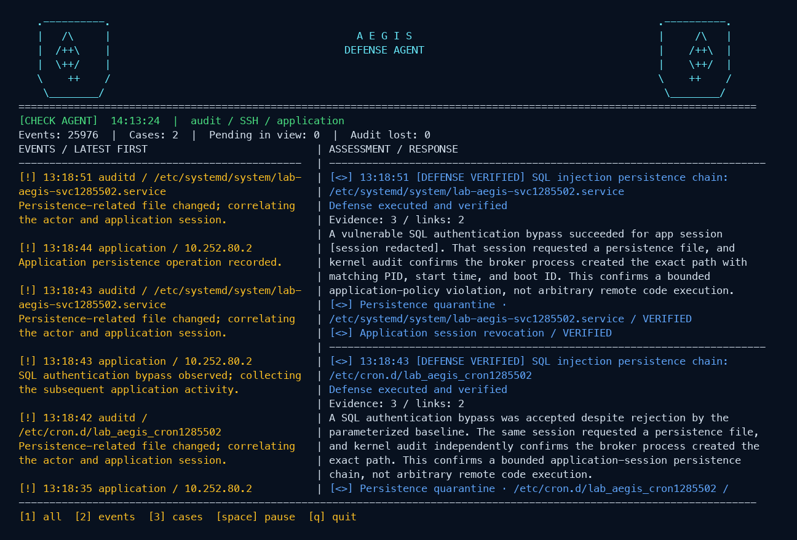
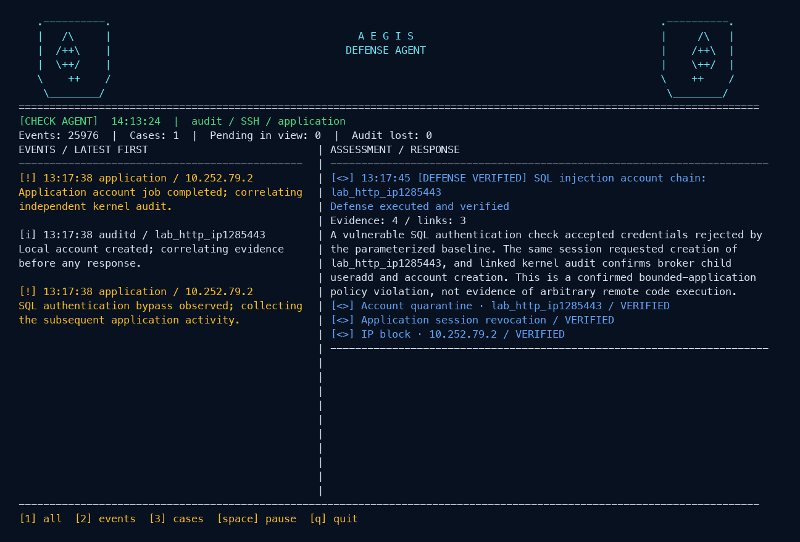
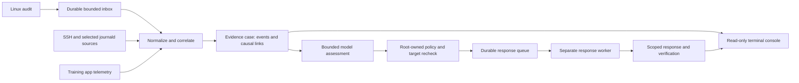

# AEGIS — Linux Defense Agent

AEGIS is a small, always-on Linux VM security prototype. It collects selected kernel audit, SSH and training-application events; joins related events into an evidence-backed case; asks a model to describe the chain; and runs a narrowly scoped response only when local policy can verify the target. The read-only console updates in a terminal while the systemd services continue working in the background.

This repository contains an intentionally vulnerable application for an **isolated training VM**. The application listens on port 8081; keep inbound access to that port closed in the cloud firewall and use an SSH tunnel for exercises.

## Terminal demo

These frames were rendered by the AEGIS console from selected **real incidents recorded during live VM tests**. They show the same layout and colors as the running terminal; the selection keeps each attack chain readable. Application session tokens are redacted in the console.

**Suspicious activity; response withheld because the link to a harmful consequence is missing.**



**Correlated SQL injection to cron/systemd persistence; exact files quarantined and session revoked.**



**Correlated account creation; account and session contained, with an enrolled dedicated-source IP blocked.**



Yellow marks suspicious observations, red marks an error or confirmed policy violation, and blue marks a verified defense. A failed login or isolated shell launch alone does not trigger an IP block. The header stays fixed while the event and case panels refresh.

## How it works



The sensors observe SSH authentication and sessions, root and application process launches, Linux account creation and successful account/group management records, the training app's SQL authentication outcome, and changes to `authorized_keys`, cron and systemd files (including user crontabs, service drop-ins, enablement links and timer files). Identity and permission watches cover `/etc/passwd`, `/etc/shadow`, `/etc/group`, `/etc/gshadow`, `/etc/sudoers` and `/etc/sudoers.d`; only audit metadata is retained, never their contents. A bounded journald reader also captures `sudo`/`su`, system service transitions, and access logs from configured web-service units (the AEGIS target and Nginx/Apache by default). Web access parsing stores method, path and status; query strings, headers and raw log messages are discarded. The training app emits a structured access record with a server-generated request ID that is also carried through broker and application telemetry, so those records join exactly. Other web-server logs are contextual unless they propagate the same request ID. Configure `journal_comms`, `journal_identifiers` and `journal_units` in `/etc/defense-agent/config.json` to select sources available on your host. A web server must send access logs to journald for this reader to see them.

This is an **explicitly configured set of sources**, not a claim to inspect every log on the VM. Both journald collectors feed a bounded 4,096-entry queue; each core loop drains up to 100 journal records, 100 durable audit records and 100 application records. Events are retained in a ten-minute correlation window, and the model receives a case snapshot after two quiet seconds, with a five-second collection cap—not a separate request for every log line. SSH session metadata links `sudo`/`su` by boot ID, audit session and login UID. The AEGIS app uses an exact shared request ID; external web events without that ID remain contextual. Source IP and nearby timestamps never prove causality or authorize a response. The console shows journal backpressure waits and reported cursor gaps.

Host-change and persistence cases are revisited once per second after batched intake. Matching boot ID, audit session and login UID bring SSH, sudo, process and file metadata into the same case, including delayed records received within the ten-minute window. Enrichment considers at most 2,048 recent relevant records and adds up to 32 matching context events per pass. Process-level links additionally require matching PID birth time; a reused PID cannot supply that link. Same-session attribution is labelled separately from causality and does not grant a response. Relative file names require a CWD from the same audit event, with partial assembly retained across core restarts. Account/group and permission changes without an existing confirmed response chain remain review-only cases.

Collection is continuous, not a 30-second polling job. Each journal source has a durable cursor, advanced only after its records have been processed and committed. Replayed records inside the ten-minute correlation window are deduplicated; older entries are skipped and cannot trigger a stale response. A full queue pauses the reader instead of discarding records. If journal retention removes a cursor, the reader reports a possible gap and falls back to the last ten minutes. Original journal boot IDs are preserved, so events from a previous boot cannot become current-session context. Auditd now writes selected records to a separate, root-private SQLite inbox before the core processes them. Inbox acknowledgment follows the same core transaction as normalized evidence and its cursor. A restart before acknowledgment replays uncommitted input; a restart after commit skips already processed records. Pending multi-record file events are saved with that cursor. PID metadata is captured on receipt and never replaced with a possibly reused live PID during replay. This covers committed inbox records, not events lost upstream by the kernel/audit dispatcher or before the producer commits. Previous-boot records are counted and skipped; records outside the ten-minute correlation window cannot trigger a stale response.

| Bound | Current value |
| --- | --- |
| In-memory journal queue | 4,096 records |
| Processing batch per core loop | Up to 100 audit + 100 journal + 100 application records |
| Audit inbox | 16 MiB payload / 50,000 records; SQLite allocation capped at 64 MiB |
| Correlation retention | Ten minutes, at most 20,000 events after periodic cleanup |
| Evidence per case / active cases | Up to 256 events (64 for host-change cases) / 256 cases |
| Recent console observations | Last 2,000 observations |

These are capacity limits, not measured events per second. When the audit inbox reaches its admission limit, it retains accepted records, counts rejected new records and raises a terminal warning; it does not silently claim lossless operation under unlimited overload. Disk/IO failures are also reported in the producer journal (and persisted when storage remains writable).

The model receives normalized events and causal links as JSON inside a single `<logs>...</logs>` block in the user message. Every value in that block is untrusted data, including role claims, encoded instructions and apparent nested tags. JSON serialization escapes `<`, `>` and `&` without changing the decoded evidence, so a logged closing tag cannot terminate the outer container. Root-generated case controls and the action catalog are sent separately in a developer message; log fields cannot replace them. The system prompt explicitly rejects attempts to suppress detection, fabricate authorization/evidence, add actions, disclose secrets or follow URLs. Model output must match the expected fields and reference only actual evidence IDs and catalog IDs.

Delimiters and prompt wording are mitigation, not a proof of immunity to prompt injection. The root policy, immutable snapshot checks, fixed action catalog and target verification remain the enforcement boundary. Model misclassification can still affect whether or when a permitted response is proposed.

The model receives a bounded case and can reference only action IDs supplied by local policy. A positive assessment at the configured confidence threshold activates the complete, ordered response plan from local policy; the model cannot omit or add actions. The privileged executor rechecks current evidence and target identity before acting. If a required link is missing, analysis fails, or the target changes, automatic response is withheld. Every action must be verified for the case to be marked defended; a failed step is recorded as `defense_error`. The model cannot issue arbitrary shell commands.

The approved plan and each action attempt are stored durably before execution. The separate `defense-response` process owns the durable queue; core collection never waits for the executor. A singleton lock prevents competing response workers, and no SQLite transaction is held during external side effects. A response-worker restart resumes unfinished steps and preserves verified results, with at most three attempts per step within a 120-second recovery window. Recovery requires the same boot and loaded configuration. Account requests pin the audited UID; file recovery verifies the preserved quarantine bytes; IP retries retain the original expiry and wait for preceding containment to succeed. An unknown outcome at the retry limit, a changed boot/policy, or a legacy interrupted case without a saved plan requires manual review. The `response_attempts` table retains attempts, and `case_versions` preserves completed responses and assessments superseded by new evidence.

| Observed chain | Default behavior |
| --- | --- |
| Failed SSH attempts, SQLi signature, or one suspicious process | Describe and continue collecting; no automatic block. |
| Confirmed SQL authentication bypass → app request → independently audited account creation | Quarantine the exact training account and revoke that app session. |
| Confirmed SQL authentication bypass → app request → independently audited cron/systemd file | Quarantine the exact training file and revoke that app session. |
| Complete account chain from a separately enrolled dedicated source | Optionally block that IP after the account response. Shared or protected sources are excluded. |

File quarantine preserves the original bytes under `/var/lib/defense-agent/quarantine/`. Automatic file action is limited to training artifacts named `lab_aegis_*` or `lab-aegis-*`; the target application itself can create only bounded, harmless training jobs. Its SQL login is deliberately vulnerable, but it does **not** provide arbitrary SQLite code execution.

## Operations and retention

The terminal shows consumed audit/journal records per second, audit and journal backlog and age, audit loss, core-loop p95, response-worker health, queued responses and database usage. Rates count input records, not attacks; application records remain in the existing source totals. The latest case shows collection, model queue, model request, result pickup and response duration in milliseconds. Missing timing values remain unknown rather than zero. Operational state is stored under `sensor_health`, `response_worker` and `storage_health`; per-case durations are in `case_timings`.

The response worker also runs bounded maintenance approximately once per minute:

| Setting in `config.json` | Default / behavior |
| --- | --- |
| `retention_days` | Seven days for completed cases, their evidence, versions and attempts |
| `database_retention_bytes` | 128 MiB used-page target; under pressure, remove oldest completed cases older than ten minutes |
| `database_max_bytes` | 256 MiB SQLite allocation cap per writer connection; exhaustion is an error, never permission to discard active cases |
| `audit_spool_bytes` / `audit_spool_records` | 16 MiB payload / 50,000 pending records |
| `model_output_max_bytes` | 32 MiB pressure warning; stale and completed result files are removed after ten minutes |
| `application_log_max_bytes` | Rotate the training application log after 16 MiB, only when the committed reader offset has reached its end |

Restart the core, response worker and auditd after changing collection/storage limits. Each maintenance pass removes at most 100 completed cases and 500 obsolete model files. Active cases and their current model results are protected. Database pages are reclaimed incrementally; the installer converts older databases once while services are stopped. Application-log reading, writing and truncation share a file lock. If unread data or active evidence prevents cleanup, the terminal reports pressure instead of deleting it. SQLite rollback journals can temporarily require additional disk space. Quarantine backups, the training application's own database and system journals are outside this retention policy.

Export a retained incident **before** its retention period expires:

```bash
sudo python3 /opt/defense-agent/maintenance.py CASE_ID --output /secure/path/incident.json
```

The export includes the case, normalized evidence, assessment history, response attempts and timings, creates a private file, and refuses to overwrite an existing path. Automatic retention is not an off-VM archive.

## Run on an isolated Ubuntu 24.04 VM

The tested Azure VM has **2 vCPUs and 4 GiB RAM**. It uses systemd, auditd, nftables, Python 3 and a managed identity authorized to call an existing `gpt-6-luna` deployment. Other compatible model deployments can be configured in [`aegis/ai.json.example`](aegis/ai.json.example). No model credential, VM key or incident database belongs in Git.

After cloning the repository onto the VM:

```bash
sudo install -d -m 0750 /etc/defense-agent
sudo install -m 0600 aegis/ai.json.example /etc/defense-agent/ai.json
sudoedit /etc/defense-agent/ai.json  # set your endpoint and deployment
sudo bash aegis/install.sh
./aegis/watch.sh
```

`watch.sh` opens the live console; `watch.sh --snapshot` prints one frame. Press `1` for both panels, `2` for events, `3` for cases, space to pause the display, and `q` to quit. Closing the console does not stop detection. The services are `defense-agent`, `defense-response`, `defense-executor`, `defense-agent-ai`, `aegis-target-broker` and `aegis-target`.

The installer creates `/etc/defense-agent/config.json` if it is absent. Before enrolling any IP for automatic blocking, add administrator and VM addresses to `protected_ips`. Dedicated-source lists are empty by default, so IP blocking is off until explicitly configured. Keep the training target reachable only through an SSH tunnel, for example `ssh -L 18091:127.0.0.1:8081 user@vm`.

The training flow is `POST /login` with `{"username":"admin' --","password":"incorrect"}`, followed by `POST /accounts` with the returned `session` and a `lab_http_*` user, or `POST /persistence` with that `session`, `"artifact":"cron"` and a fresh `name`. `POST /shell` exercises application process monitoring with a fixed harmless command. Synthetic valid credentials are shown at the target's `GET /` page. AEGIS itself has no web interface.

## Test and operational limits

```bash
python3 -m unittest discover -s aegis/tests -q
```

The current suite has **139 unit tests**. The `aegis/live-app-tests.py`, `aegis/live-persistence-tests.py`, `aegis/live-session-tests.py` and `aegis/live-firewall-tests.py` scripts exercise the real VM, kernel audit and response path. `aegis/live-recovery-tests.py` additionally crashes a fixture response after real account/file side effects, verifies recovery from missing results, and checks journal replay across reader downtime. Its fixture plan tests recovery independently of model classification. `aegis/live-operations-tests.py` tests real audit collection during core downtime, a real process burst, and continued ingestion while a separate fixture response is delayed. `aegis/live-telemetry-tests.py` opens real SSH sessions, performs an inert group/file-change sequence and checks session isolation, terminal explanations and restart retention. `aegis/live-prompt-tests.py` uses the real model against baseline and adversarial evidence with a recording executor, so it does not perform defensive side effects. Stop `defense-agent-ai` for that script and restart it afterwards; it reserves calls against the existing hourly budget and spacing without resetting counters. Run those scripts as root, one at a time, **only on the isolated training VM**. They create temporary users, files and network namespaces and clean up their active changes; the incident history remains available.

The console polls its read-only database every second. Case assessment waits for a two-second quiet period, and model starts are limited to at least eight seconds apart and 40 calls per hour by default. Evidence correlation is bounded to ten minutes. These settings support near-real-time operation but are **not a response-time guarantee** under load or model throttling. Production use would need off-VM evidence retention, external alert delivery, sustained load testing beyond the bounded lab burst, and removal or stronger isolation of the privileged training broker.

Source and tests are under [`aegis/`](aegis/). Local VM logs, keys, generated case data and deployment work files are excluded from Git.

## Inspect an incident in the terminal

Press **4** for the incident chain, **n/p** to select a case and **j/k** to scroll while the AEGIS header remains fixed. **1/2/3** return to the existing views. A selected case stays selected during refreshes. Case IDs appear in the case overview.

```sh
sudo -u defense-ai python3 /opt/defense-agent/console.py --case CASE_ID
sudo -u defense-ai python3 /opt/defense-agent/console.py --case CASE_ID --snapshot
```

If `watch.sh` is run from the repository, use `sudo bash aegis/watch.sh` with the same arguments. The `--snapshot --case` combination prints the complete case rather than cropping it to terminal height. The view separates UTC event chronology and source/actor metadata, verified links, session attribution, contextual matches, unlinked evidence, the local response gate, model uncertainty/confidence and verified action results. A confidence score is not a calibrated probability. Inode mode/owner metadata describes the audit-time record, not a content diff or a guaranteed before/after comparison. Missing process identity and case capacity limits are shown explicitly.

## Source health

Press **5** or start the console with `--sources`. The fixed header includes a compact status summary; the detailed screen shows kernel audit, SSH journald, selected service journald and the bundled application's trusted JSONL source. Each row includes last intake, outstanding records/bytes, backlog delay and a reason. **j/k** scroll the details.

| State | Meaning |
| --- | --- |
| `LIVE` | Collector is running and received input in the last 30 seconds. |
| `QUIET` | Collector is running, with no recent input. Silence alone is not a failure. |
| `DOWN` | Reader/producer is stopped, missing, or its input is unavailable. |
| `LAGGING` | A backlog has been delayed for at least five seconds. |
| `GAP` | Loss, invalid input or possible cursor/file continuity loss was recorded. |
| `DISABLED` | Source is disabled by configuration. |
| `STALE` | Core health is older than 15 seconds; last-known source status is not current. |
| `UNKNOWN` | No source-health snapshot is available yet. |

Health is sampled every five seconds; the kernel audit status probe runs every 30 seconds. Process checks include PID birth identity and detect a stopped process even when its pipe still exists. The application checks the HTTP service and broker as well as the file reader; application backlog delay is the duration of a nonempty byte backlog. Cursor/file gaps remain warnings after recovery, including core restarts. A running collector does not prove every service emits logs: this screen describes the configured sources, not all logs on the machine. It is local status only, without an external heartbeat or alerts.

`aegis/live-source-health-tests.py` briefly suspends/resumes collectors and core and stops/restarts the training broker on the isolated VM, preserving evidence. It saves source-only snapshots for visual checks and restores running components in cleanup.

## Change log

### 2026-10-08 — Per-source collection health in the terminal

- Add a source-health screen (`5` / `--sources`) and an always-visible summary, with green live/quiet states, yellow backlog/gap warnings and red down/stale states. Display intake age, backlog and the reason for each status.
- Check journal process identity/state, the audit producer and kernel audit status, and application reader/broker availability independently of log traffic. Persist audit intake timestamps and continuity warnings; stop presenting old source states as current when the core heartbeat expires.
- Report missing application input, malformed application records and possible file replacement/truncation gaps. Keep detection and response permissions unchanged.
- Validated on the Azure VM: **139 unit tests**, **11 live source-health checks** (including process suspension/recovery and stale core detection) and **17 application-defense regression checks** passed. Captured source-only terminal snapshots during normal operation and controlled interruption.


### 2026-10-08 — Terminal incident chains and host-change telemetry

- Add a scrollable incident-chain view with a fixed AEGIS header, stable case selection and complete `--case ID --snapshot` output. Separate chronological facts, sources, actor/process identity, verified links, session attribution, contextual matches, missing links, model uncertainty and the local response gate. Confidence is explicitly an assessment score, not a probability.
- Observe successful account/group management and credential-attribute records, plus metadata changes to account databases and sudoers. Expand persistence coverage to cron directories/user crontabs and systemd drop-ins, enablement links and timers. Keep file contents, passwords, keys and command arguments out of normalized model evidence.
- Reassemble relative audit paths with the same event's CWD, retain partial assembly across restarts and enrich pending cases with delayed SSH/sudo/process/file records. Match boot/session/login UID; process links also require PID birth identity. Keep existing response permissions unchanged: standalone identity or permission changes do not authorize containment.
- Bound host-change cases to 64 events and session-context additions to 32 events per pass; document the search/correlation bounds and show case-capacity or missing-process-identity limitations in the terminal.
- Validation on the Azure Linux VM: **124 unit tests**, **13 live telemetry/model checks** and **42 existing live defense checks** (eight SSH, 17 application, 17 persistence) passed. Tests cover real group/file changes, same-user session isolation, restart retention, model description without unauthorized actions, and existing verified containment behavior. The deployed console also passed an unprivileged full-report check and an interactive terminal navigation/scroll/exit check; installed source hashes matched the tested revision.

### 2026-10-08 — Untrusted log boundary and prompt-injection regression tests

- Put normalized events and causal links inside one `<logs>` block in the user message, with JSON escaping of `<`, `>` and `&` and unchanged decoded evidence. Send only root-generated case controls and the permitted action catalog in a separate developer message.
- Strengthen system instructions against forged roles/policies, delimiter escapes, multilingual or encoded directives, forced actions and attempts to suppress a confirmed chain. Treat every log value as data regardless of its claimed authority.
- Require the exact model output fields and reject fabricated/duplicate evidence IDs, extra commands/action parameters and unknown catalog IDs. Preserve the original snapshot hash and independent root policy/executor checks.
- All **106 unit tests passed on the Azure VM**. The actual `gpt-6-luna` deployment passed **14 model/core fixture checks**: two controls and six adversarial payloads each tested with and without a confirmed chain. No unauthorized action was recorded and confirmed chains retained their complete response plans. These use a recording executor and do not claim exhaustive immunity to prompt injection.
- All **42 live defense checks passed on the VM**: eight SSH, 17 application and 17 persistence checks. Confirmed chains triggered verified session containment, account/file quarantine and dedicated-source traffic blocking; failed logins, standalone SQL bypass and legitimate activity did not trigger those responses.

### 2026-10-07 — Durable audit intake, independent responses and retention

- Replaced the audit datagram handoff with a bounded, root-private SQLite inbox. Commit normalized evidence, partial file-event assembly and the consumer cursor together before acknowledging input. Preserve receive-time PID metadata across replay; retain accepted records and report rejected input when the inbox fills.
- Moved response execution into the singleton `defense-response` service. The core only enrolls the approved plan, so executor delays no longer stop intake or correlation. Existing recovery, policy checks and verified-action requirements remain enforced.
- Added terminal input rates, backlog and age, audit-loss and storage warnings, core-loop p95, response-worker status, and per-case collection/model/response timings.
- Added configurable retention of completed cases, related history and obsolete model files, a SQLite allocation limit, incremental space reclamation and consumed-only application-log rotation. Active cases and unread application records are protected. Added private, non-overwriting incident export with evidence and response attempts.
- Validated on the existing 4 GiB Azure VM: **101 unit tests and 61 live checks passed** (11 recovery/replay, 8 operations, 8 SSH, 17 application, 17 persistence). Included overflow, transaction rollback, restart between audit file records, retention protection, database allocation limits and export tests.
- The real 200-process burst was fully observed in **1.331 seconds**, with no increase in kernel or inbox loss counters. In a separate fixture, the core consumed 100 records in **0.084 seconds** while an independent executor deliberately waited 15 seconds. These bounded lab measurements are not sustained-throughput or response-time guarantees.


### 2026-10-07 — Recoverable responses and continuous journal replay

- Persist the authorized response plan and every attempt before execution. Resume unfinished steps after a core restart, retain verified results, and stop retries after three attempts or 120 seconds. Changed boot/configuration or uncertain terminal outcomes require manual review.
- Preserve completed responses and earlier assessments when new evidence arrives. Pin account UID, reconcile already-quarantined files from their preserved content, and withhold IP blocking until preceding containment is verified.
- Save a cursor for each journald source only after processing its batch. Resume retained records after downtime, deduplicate within the ten-minute window, pause on queue pressure, and expose cursor gaps in the terminal. Preserve and normalize real boot IDs; discard stale records instead of treating them as new attacks.
- Keep collection continuous, with up to 100 journal records per loop and case snapshots after two quiet seconds (five-second collection cap). Document queue, case and retention limits; do not introduce 30-second detection polling.
- Validated the exact installed source on the Azure VM: **86 unit tests and 53 live checks passed** (11 crash/replay, 8 SSH, 17 application, 17 persistence). Live testing exposed a journald/kernel boot-ID formatting mismatch; fixed it, added a regression test, and reran the suites.
- Verified active SSH attacker-session termination while benign sessions survived, real HTTP blocking only for an enrolled dedicated source after a confirmed chain, SQLi account quarantine and session revocation, and cron/systemd quarantine. Failed logins, a SQL bypass alone and legitimate changes did not trigger IP blocking.
- Checked the live terminal and verified that an IP-block retry does not extend the original expiry. Final response steps in the four SSH/account-creation chains completed approximately 7.7–8.7 seconds after the last evidence event in this run; this is a lab measurement, not a latency guarantee.

### 2026-10-06 — Expanded telemetry and event correlation

- Added bounded journald collection for `sudo`/`su`, selected systemd services, and Nginx/Apache access logs, alongside the existing SSH, audit and AEGIS application sources.
- Grouped incoming events into short, bounded case snapshots and retained a ten-minute correlation window, so the model can assess related activity across sources instead of isolated log lines.
- Added server-generated request IDs to join AEGIS HTTP access records to application events exactly; unrelated proxy records remain context and cannot authorize a response.
- Kept sensitive query strings, headers and command arguments out of stored telemetry, and exposed queue drops and sensor health in the console data.
- Added correlation regression tests and verified the expanded flows against the isolated Azure training VM.

### 2026-10-06 — Complete policy-driven response plans

- Made local policy, rather than the model's action selection, the source of the complete ordered response plan after a positive assessment at the confidence threshold.
- Required the full causal evidence set before any response, and kept a case out of `defended` unless every action returns verified success.
- Added regression tests for a model returning only part of the plan and for missing evidence. All 67 unit tests passed.
- Re-ran the live SSH account-creation exercise on the Azure lab VM: the account was quarantined; the short test session had already closed, which the executor verified; and the source IP remained reachable without prior failures. The response completed about 9.4 seconds after the last evidence event in this run. The VM was deallocated after testing.
