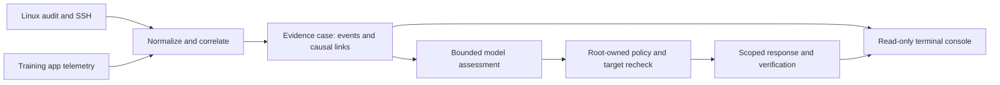

# AEGIS — Linux Defense Agent

AEGIS is a small, always-on Linux VM security prototype. It collects selected kernel audit, SSH and training-application events; joins related events into an evidence-backed case; asks a model to describe the chain; and runs a narrowly scoped response only when local policy can verify the target. The read-only console updates in a terminal while the systemd services continue working in the background.

This repository contains an intentionally vulnerable application for an **isolated training VM**. The application listens on port 8081; keep inbound access to that port closed in the cloud firewall and use an SSH tunnel for exercises.

## Terminal demo

These frames were rendered by the AEGIS console from selected **real incidents recorded during live VM tests**. They show the same layout and colors as the running terminal; the selection keeps each attack chain readable. Application session tokens are redacted in the console.

**Suspicious activity; response withheld because the link to a harmful consequence is missing.**


**Correlated SQL injection to cron/systemd persistence; exact files quarantined and session revoked.**


**Correlated account creation; account and session contained, with an enrolled dedicated-source IP blocked.**


Yellow marks suspicious observations, red marks an error or confirmed policy violation, and blue marks a verified defense. A failed login or isolated shell launch alone does not trigger an IP block. The header stays fixed while the event and case panels refresh.

## How it works



The sensors observe SSH authentication and sessions, root and application process launches, Linux account creation, the training app's SQL authentication outcome, and changes to `authorized_keys`, cron and systemd files. A bounded journald reader also captures `sudo`/`su`, system service transitions, and access logs from configured web-service units (the AEGIS target and Nginx/Apache by default). Web access parsing stores method, path and status; query strings, headers and raw log messages are discarded. The training app emits a structured access record with a server-generated request ID that is also carried through broker and application telemetry, so those records join exactly. Other web-server logs are contextual unless they propagate the same request ID. Configure `journal_comms`, `journal_identifiers` and `journal_units` in `/etc/defense-agent/config.json` to select sources available on your host. A web server must send access logs to journald for this reader to see them.

This is an **explicitly configured set of sources**, not a claim to inspect every log on the VM. Both journald collectors feed a bounded 4,096-entry queue; the core drains up to 100 events per loop. Events are retained in a ten-minute correlation window, and the model receives a case snapshot after two quiet seconds, with a five-second collection cap—not a separate request for every log line. SSH session metadata links `sudo`/`su` by boot ID, audit session and login UID. The AEGIS app uses an exact shared request ID; external web events without that ID remain contextual. Source IP and nearby timestamps never prove causality or authorize a response. The console shows queue drops so sensor backpressure is visible.

The model receives a bounded case and can reference only action IDs supplied by local policy. A positive assessment at the configured confidence threshold activates the complete, ordered response plan from local policy; the model cannot omit or add actions. The privileged executor rechecks current evidence and target identity before acting. If a required link is missing, analysis fails, or the target changes, automatic response is withheld. Every action must be verified for the case to be marked defended; a failed step is recorded as `defense_error`. The model cannot issue arbitrary shell commands.

| Observed chain | Default behavior |
| --- | --- |
| Failed SSH attempts, SQLi signature, or one suspicious process | Describe and continue collecting; no automatic block. |
| Confirmed SQL authentication bypass → app request → independently audited account creation | Quarantine the exact training account and revoke that app session. |
| Confirmed SQL authentication bypass → app request → independently audited cron/systemd file | Quarantine the exact training file and revoke that app session. |
| Complete account chain from a separately enrolled dedicated source | Optionally block that IP after the account response. Shared or protected sources are excluded. |

File quarantine preserves the original bytes under `/var/lib/defense-agent/quarantine/`. Automatic file action is limited to training artifacts named `lab_aegis_*` or `lab-aegis-*`; the target application itself can create only bounded, harmless training jobs. Its SQL login is deliberately vulnerable, but it does **not** provide arbitrary SQLite code execution.

## Run on an isolated Ubuntu 24.04 VM

The tested Azure VM has **2 vCPUs and 4 GiB RAM**. It uses systemd, auditd, nftables, Python 3 and a managed identity authorized to call an existing `gpt-6-luna` deployment. Other compatible model deployments can be configured in [`aegis/ai.json.example`](aegis/ai.json.example). No model credential, VM key or incident database belongs in Git.

After cloning the repository onto the VM:

```bash
sudo install -d -m 0750 /etc/defense-agent
sudo install -m 0600 aegis/ai.json.example /etc/defense-agent/ai.json
sudoedit /etc/defense-agent/ai.json  # set your endpoint and deployment
sudo bash aegis/install.sh
./aegis/watch.sh
```

`watch.sh` opens the live console; `watch.sh --snapshot` prints one frame. Press `1` for both panels, `2` for events, `3` for cases, space to pause the display, and `q` to quit. Closing the console does not stop detection. The services are `defense-agent`, `defense-executor`, `defense-agent-ai`, `aegis-target-broker` and `aegis-target`.

The installer creates `/etc/defense-agent/config.json` if it is absent. Before enrolling any IP for automatic blocking, add administrator and VM addresses to `protected_ips`. Dedicated-source lists are empty by default, so IP blocking is off until explicitly configured. Keep the training target reachable only through an SSH tunnel, for example `ssh -L 18091:127.0.0.1:8081 user@vm`.

The training flow is `POST /login` with `{"username":"admin' --","password":"incorrect"}`, followed by `POST /accounts` with the returned `session` and a `lab_http_*` user, or `POST /persistence` with that `session`, `"artifact":"cron"` and a fresh `name`. `POST /shell` exercises application process monitoring with a fixed harmless command. Synthetic valid credentials are shown at the target's `GET /` page. AEGIS itself has no web interface.

## Test and operational limits

```bash
python3 -m unittest discover -s aegis/tests -q
```

The current suite has **67 unit tests**. The `aegis/live-app-tests.py`, `aegis/live-persistence-tests.py`, `aegis/live-session-tests.py` and `aegis/live-firewall-tests.py` scripts exercise the real VM, kernel audit and response path. Run those scripts as root, one at a time, **only on the isolated training VM**. They create temporary users, files and network namespaces and clean up their active changes; the incident history remains available.

The console polls its read-only database every second. Case assessment waits for a two-second quiet period, and model starts are limited to at least eight seconds apart and 40 calls per hour by default. Evidence correlation is bounded to ten minutes. These settings support near-real-time operation but are **not a response-time guarantee** under load or model throttling. Production use would need off-VM evidence retention, log rotation, sensor-loss alerting, load testing, and removal or stronger isolation of the privileged training broker.

Source and tests are under [`aegis/`](aegis/). Local VM logs, keys, generated case data and deployment work files are excluded from Git.

## Change log

### 2026-10-06 — Expanded telemetry and event correlation

- Added bounded journald collection for `sudo`/`su`, selected systemd services, and Nginx/Apache access logs, alongside the existing SSH, audit and AEGIS application sources.
- Grouped incoming events into short, bounded case snapshots and retained a ten-minute correlation window, so the model can assess related activity across sources instead of isolated log lines.
- Added server-generated request IDs to join AEGIS HTTP access records to application events exactly; unrelated proxy records remain context and cannot authorize a response.
- Kept sensitive query strings, headers and command arguments out of stored telemetry, and exposed queue drops and sensor health in the console data.
- Added correlation regression tests and verified the expanded flows against the isolated Azure training VM.

### 2026-10-06 — Complete policy-driven response plans

- Made local policy, rather than the model's action selection, the source of the complete ordered response plan after a positive assessment at the confidence threshold.
- Required the full causal evidence set before any response, and kept a case out of `defended` unless every action returns verified success.
- Added regression tests for a model returning only part of the plan and for missing evidence. All 67 unit tests passed.
- Re-ran the live SSH account-creation exercise on the Azure lab VM: the account was quarantined; the short test session had already closed, which the executor verified; and the source IP remained reachable without prior failures. The response completed about 9.4 seconds after the last evidence event in this run. The VM was deallocated after testing.
